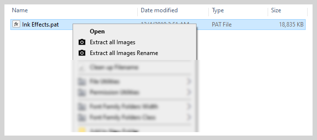

## Extract and save images from Photoshop pattern files `(.pat)` quickly and easily.

Note: .PAT Image Extractor **heavily** depends on .PAT format parser code originally released by [Jaroslav Bereza](https://github.com/jardicc/pat-parser).

I've modified the code to accept dynamic parameters and wrote a small PowerShell wrapper that can be invoked by the Windows registry for tight integration with the right-click context menu. 

The PowerShell script also makes use of `SingleInstanceAccumulator` (https://github.com/Beej126/SingleInstanceAccumulator) to provide support for processing multiple files at once in Windows Explorer without running multiple instances of the terminal and also hiding the CLI window.

## Requirements
Node.js (https://nodejs.org/en/)
Powershell 7 (https://docs.microsoft.com/en-us/powershell/scripting/install/installing-powershell-on-windows?view=powershell-7.2#msi)

## Installation

 1. Clone the repository somewhere and open a command prompt from inside the main directory.
 2. Run `npm install` to download all required dependencies.
 3. Edit the `ExtractImages.reg` file, modifying the included paths to each referenced file so they match the file structure on your system.
 4. Merge the registry file by double clicking on it and pressing yes to the prompt that appears.

## Usage
Simply right click on any Photoshop .PAT file and select either `Extract all Images` or `Extract all Images Rename`.

The script will begin processing and save all images to a folder with the same name as the .PAT file. 

- If you select `Extract all Images`, the extracted images will retain their names as they appear in Photoshop. 

- If you select `Extract all Images Rename`, the extracted images will be renamed to the name of the `.PAT` file and serialized.

When the conversion is complete, a dialog box will appear notifying you of completion.
